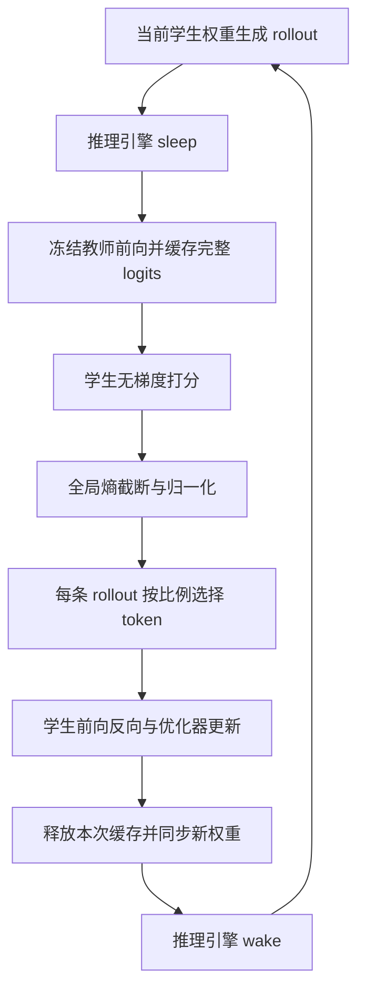

# On-policy 蒸馏训练优化：思路、取舍与验证

> 日期：2026-10-01
>
> 范围：缓存放置、模型及优化器状态驻留、分布式边界修复、性能验收。
>
> 结论：减少更新路径中的主机与设备往返搬运，同时保留原有模型方法、精度与 on-policy 时序，已获得有界测试中的明显提速。

## 1. 从哪里开始定位

我们先把一次训练迭代拆为生成、教师前向与缓存、模型切换、学生打分、TIP 选择、学生前向反向、优化器更新、权重同步、保存和验证。

阶段 profile 显示，教师 logits 缓存和参数/优化器 offload 有可观成本。蒸馏使用完整词表分布，缓存规模随有效 response token 数和词表大小增长：

\[
M_{cache} \approx N_{response}\times V_{vocab}\times bytes(dtype)
\]

TIP 还会先用这些 logits 做无梯度打分，再用被选中的 token 做反向传播。因此，把教师结果存到 CPU 后再读回设备，会在一次更新内重复搬运。原实现优先节省显存；容量允许时，可以用更多设备存储换取更少搬运。

这些观察支持优化搬运路径，但不足以把整个任务判定为单一显存带宽瓶颈。生成、前向反向、分布式通信和权重同步仍共同决定整步时间。

## 2. 分两步验证收益

| 实验 | teacher logits cache | 参数与优化器 | 目的 |
|---|---|---|---|
| 基线 | CPU | 原有 offload | 建立同配置对照 |
| 候选一 | GPU | 保留原有 offload | 单独观察缓存位置的收益 |
| 候选二 | GPU | 教师、学生及 AdamW 状态驻留 | 再减少参数和状态的重复搬运 |

先做两步诊断实验，再关闭阶段同步 profiling 做原始数据的有限步对照。诊断计时会插入 CUDA 同步，不能与关闭 profiling 的训练数据混在一起算收益。

另一组物理并行配置探索没有给出足够稳定的收益证据，因此最终保留原配置。我们也保留原来的微批次、gradient checkpointing、attention 实现和生成参数，避免把多个变化混成一个优化结论。

## 3. 两项关键实现

### 3.1 教师缓存留在设备上

教师仍使用 `eval()` 和 `no_grad()`。输出保留 BF16、完整词表和原始值；token stats 与 reverse KL 仍转换为 FP32、按原 token chunk 计算。

缓存先供学生无梯度打分，再供选中 token 的训练使用。更新结束后删除缓存的持有引用，随后同步学生新权重并恢复生成。`del` 只有在最后一个引用消失时才使 tensor 可释放；`empty_cache()` 不能释放仍被引用的 tensor。缓存生命周期需要实际检查，不能只看调用了一次清理函数。

### 3.2 核对真正的状态驻留

外层 `param_offload=False` 并不保证底层 FSDP 关闭了 CPU offload。所用固定框架版本的 reference 构造分支会额外启用内部 offload，只跳过外层 load/offload 调用仍会搬运。

我们为该固定版本增加受约束的构造 helper，保留教师 worker 身份、权重、stored dtype 和包装配置。构造前拒绝不兼容的策略、LoRA、QAT 和教师优化器设置；构造后检查实际 FSDP wrapper 的 offload 标志、参数 device/dtype，以及没有生成教师 optimizer/scheduler。

该 helper 仅适用于已核对的构造路径。它不是可以直接复制到任意框架版本的“改 role”技巧。

## 4. 保持方法与更新时序

TIP 的“全局”指跨 rank、跨 microbatch 的熵截断和 min-max 归一化。Soft-OR 得分随后用于每条 rollout 的 token 排序，按 `floor(keep_ratio × 有效response长度)` 选择；它不是对整个 batch 直接取总量 top 50%。

本次保留学生/教师 checkpoint、BF16 前向、FP32 loss、reverse KL、TIP 比例、采样策略、长度、全局 batch、优化器、完整 LR horizon 和生产保存/评估频率。下一轮生成在学生更新并同步权重之后开始，时序仍为 on-policy。

另修复了一个分布式边界：本 rank 没有入选 token 时，仍通过零损失 backward 参与 FSDP collective；只要全局执行了更新，各 rank 都推进 scheduler。按本地 token 数决定是否推进，会造成 rank 间 LR 进度不一致。

## 5. 验证顺序和证据边界

| 层次 | 验证内容 | 已证明的范围 |
|---|---|---|
| 缓存数值 | CPU/GPU cache 的 entropy、KL、选择、loss、梯度、权重和 Adam 状态 | 合成模型路径的精确比较 |
| 分布式边界 | 多 microbatch、跨 chunk、整 rank 零有效 token、scheduler、缓存释放 | 实际 OPD update 的合成 FSDP 路径 |
| 真实模型短稳定性 | 原数据与完整 LR horizon，提前停止；保存和小样本验证 | 有限步真实模型集成 |
| 最长序列容量 | 先通过更新分配 Adam 状态，再测试最大 response 和生成引擎 sleep/wake | 已测长序列路径的容量 |
| 恢复 | model、optimizer、scheduler、RNG 和 dataloader 连续性 | 已保存状态能够恢复并继续更新 |
| 全量训练 | 完整时长、最终 benchmark 与收敛 | 需要另行汇总完整运行结果 |

有一组基线训练已完成，但观察器要求一条未输出的 INFO 结束文字而误报失败。我们保留原退出码和日志，对已经完成的更新、checkpoint、验证输出及执行源码进行 CPU 事后复核。该复核与训练退出证据分别记录，候选正常退出的要求继续保留。

## 6. 现有性能结果如何解读

采用同配置、同环境、关闭阶段 profiling 的有限步对照，以下数字将各自基线均值归一化为 100：

| 口径 | 基线 | 优化后 | 耗时减少 | 样本 |
|---|---:|---:|---:|---|
| 更新阶段，含蒸馏 batch 构造与权重同步 | 100 | 52.61 | 47.39% | 排除首步后的五次更新 |
| 普通整步，排除冷启动、保存和验证 | 100 | 73.84 | 26.16% | 两条普通 step |

两组随机生成轨迹不同，平均 response token 总量接近，但长度分布和 attention 工作量不完全相同。更新路径的收益也不会按相同比例传递到生成、保存和验证阶段，所以整步收益小于更新阶段收益。

用户反馈当前运行明显更快，可作为运行体验记录；这里的量化结论仍来自上述有界对照。完整生产日志尚未在本次文档工作中重新采集，不能据此宣称全量提速比例或最终精度完全保持。

## 7. 工程收尾

生产入口绑定已验证配置、源码与报告校验和，阻止未经验证的改动直接复用验收结论。日志保留阶段、step、loss、LR、时间和保存进度，便于区分初始化、生成和更新阶段。

保活与实际 GPU 工作互斥：CPU 准备时检查保活，GPU 子任务开始前关闭，任务正常退出或异常收尾后恢复。文档整理属于 CPU 工作，不更改正在执行的训练状态。

后续完整结果应同时报告普通 step、生成、更新、保存/验证开销、实际 wall time、最终 benchmark 和 checkpoint 恢复情况。缓存等价性和短稳定性分别提供对应层面的证据。

## 8. 文件索引

| 文件 | 用途 |
|---|---|
| [opd_worker.py](src/opd/opd_worker.py) | 缓存位置、update 生命周期、全局 scheduler 条件 |
| [resident_ref.py](src/opd/resident_ref.py) | 固定版本的教师驻留构造与断言 |
| [train_opd.sh](scripts/opd/train_opd.sh) | 缓存、驻留及 profiling 开关 |
| [缓存等价性证据](results/optimization-20261001/cache-equivalence.json) | 单设备合成模型比较 |
| [分布式等价性证据](results/optimization-20261001/cache-distributed.json) | 实际 update 路径与状态比较 |
| [零 token rank 证据](results/optimization-20261001/cache-zero-rank.json) | 边界 collective 和 scheduler |
| [稳定性对照](results/optimization-20261001/stability-comparison.json) | 原始计时、统计公式及验证索引 |
| [恢复证据](results/optimization-20261001/stability-resume-verification.json) | 完整训练状态恢复 |
| [基线事后复核](results/optimization-20261001/baseline-reverification.json) | 原观察器异常及证据保留 |
| [分享稿](TECHNICAL_SHARE_ON_POLICY_DISTILLATION.md) | 可独立分享的软件优化原理 |
| [归一化数据](assets/opd-optimization/normalized_timings.json) | 相对结果与样本口径 |
| [绘图脚本](assets/opd-optimization/plot_normalized_timings.py) | 复现本文配图 |

工程索引链接的原始证据用于项目内追溯。独立分享请使用分享稿及其匿名配图/数据。
