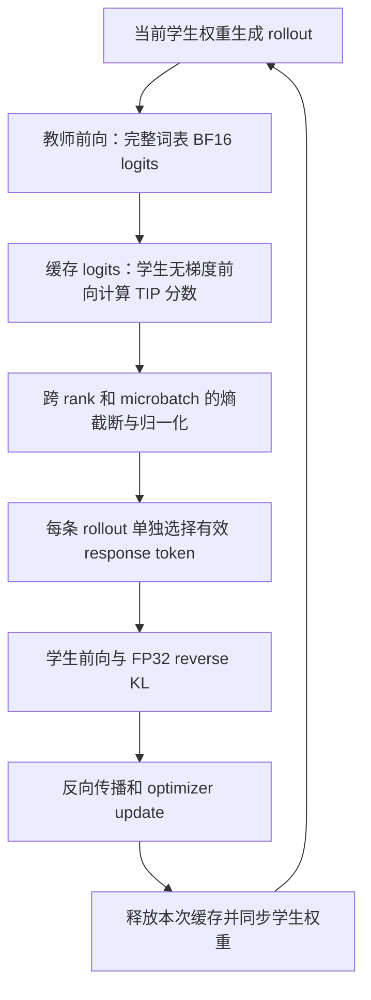
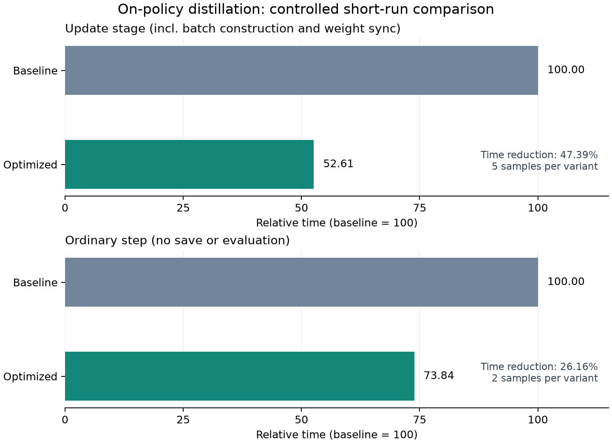

# On-policy 蒸馏加速实践：减少数据搬运，保留训练语义

## 核心思路

一次蒸馏更新涉及 rollout、教师打分、token 选择、学生反向和权重同步。显存不足时，CPU offload 可以让任务运行；当容量充足后，反复搬运教师 logits、模型参数和优化器状态可能成为显著开销。

本次优化将完整教师 logits 缓存留在 GPU，并让教师、学生及优化器状态驻留 GPU。模型、采样、训练精度、TIP 计算、loss、batch、并行设置和完整学习率调度配置保持一致；另修复零 token rank 的 scheduler 推进条件。短测试中，更新阶段的归一化耗时从 **100 降至 52.61**，普通整步从 **100 降至 73.84**。更新阶段包含蒸馏 batch 构造、worker 更新及权重同步。这证明所测条件下执行路径有收益，完整训练速度和最终精度仍须通过完整实验确认。

## 1. 先画出一次更新的数据流



这里的 on-policy 要求：下一批 rollout 使用本次更新并同步后的学生权重。更新尚未完成就用旧权重生成下一批数据，会引入策略滞后，需要另做算法验证。

TIP 的“全局”也需要精确定义：熵截断和 min-max 归一化汇总所有 rank、所有 microbatch 的有效 token；随后按每条 rollout 的分数，选择 `floor(0.5 × 有效 response token 数)`。不能将其替换为整个 batch 一次选最高的一半，也不能改为各 microbatch 独立归一化。

学生先做无梯度打分，再重建用于反向的前向图；这两遍需要对应同一策略。现有实现检查 dropout 为零，防止打分和训练因随机 dropout 使用不同预测。分布式 loss 的缩放也须得到全局选中 token 的均值，不能改成各 rank 的局部均值平均。

## 2. 两层优化：缓存位置与参数驻留

### 将完整教师 logits 留在 GPU

原路径在教师前向后将 logits 搬到 CPU，学生更新时再搬回 GPU。改为 GPU 缓存后，两次搬运可以省去；缓存保留原 BF16 数值，loss 仍在 FP32 中按 token chunk 计算。

缓存包含完整词表分布，用于 TIP 打分和 reverse KL。将其改为 top-k、缩小词表或压缩数值，会改变计算输入，不能当作单纯的存储位置优化。

容量预算可以写成：

\[
M_{cache}=N_{response\ tokens}\times V_{vocab}\times bytes_{dtype}
\]

还要同时容纳参数、梯度、Adam 状态、学生激活、loss 临时张量及共置 rollout 引擎。平均 response 长度不足以证明容量安全。

### 确认实际驻留，而非只修改配置

关闭外层 offload 开关后，需要检查实际构造出的 FSDP 实例。本次固定版本的构造器，对 reference 分支仍会启用内部 CPU offload，因此单看配置文件会误判。

处理方式是使用**版本限定的构造适配器**，配合前置条件和结果断言：确认支持的 FSDP 路径；教师不创建 optimizer 或 scheduler；检查每个 FSDP wrapper 的内部 offload 状态、参数设备、存储 dtype 和角色绑定。教师前向继续使用 eval/no-grad，避免构建教师的反向图。

这种适配器依赖具体实现，不能概括为“换一个角色就能驻留”。升级框架后，应重新核查构造分支及全部断言。参数存储 dtype 与前向 autocast dtype 是两个检查项；本次未借驻留改变精度。

## 3. 缓存生命周期要覆盖权重同步和 rollout 唤醒

缓存只能属于当前 update。教师打分和学生反向完成后，需要在恢复 rollout 引擎之前清理，避免两个阶段的显存需求叠加。

下面是结构伪代码，省略了框架相关实现：

```python
def update_once(rollouts):
    cache = []
    try:
        for micro in split_microbatches(rollouts):
            with torch.no_grad(), bf16_forward():
                logits = teacher_forward(micro)  # full vocabulary
            cache.append(logits.detach())        # retain on GPU
            del logits                           # cache still owns it

        stats = score_all_microbatches(rollouts, cache)  # student no-grad pass
        global_stats = gather_valid_stats_across_ranks(stats)
        masks = global_normalize_then_select_per_rollout(global_stats)
        global_tokens = count_selected_tokens_globally(masks)
        if global_tokens == 0:
            raise RuntimeError("no selected tokens in the global batch")

        optimizer.zero_grad()
        # Scale each micro loss before backward:
        # n_selected * world_size / global_tokens (FSDP averages gradients).
        backward_reverse_kl_in_fp32_chunks(
            rollouts, cache, masks, global_tokens=global_tokens
        )
        clip_gradients_then_optimizer_step()
        if global_tokens > 0:
            scheduler.step()  # all ranks use the same condition
    finally:
        cache.clear()
        del cache

    sync_student_weights_to_rollout()
    wake_rollout_engine()
```

`del logits` 只删除一个 Python 引用；缓存、view、闭包或 autograd graph 仍持有引用时，存储不会释放。只有所有引用消失后，allocator 才能复用相应空间。`torch.cuda.empty_cache()` 只能归还未使用的缓存块，不能释放 live tensor；也不应在每个 microbatch 后机械调用。

## 4. 一个容易漏掉的分布式边界

某个 rank 没有选中 token，不代表全局没有更新。其他 rank 有贡献时，该 rank 仍需要参加分布式通信，并与其他 rank 一起推进 scheduler。

因此，LR 是否前进应由**全局有效更新**决定。使用本地 token 数作为条件，可能导致 rank 间 scheduler 状态分叉。本实现对整个全局 batch 没有选中 token 的情况拒绝更新；各 rank 的处理必须一致。

## 5. 为什么先做驻留，暂不采用其他路线

| 路线 | 取舍与验证要求 |
|---|---|
| 反复 CPU offload | 节省显存，但增加搬运与阶段切换；容量不足时仍有必要 |
| GPU 缓存和状态驻留 | 消耗更多显存，减少搬运；保留原张量值和同步训练顺序 |
| 量化或压缩 logits | 改变教师分布或数值误差，需要独立精度实验 |
| 跨 update 的 rollout overlap | 使用旧策略生成下一批数据可能改变 on-policy 语义 |
| 同一 update 内的通信 overlap | 有机会保留语义，但需检查依赖、同步和全局归约次序 |

本次先验证存储位置及生命周期变化，降低同时改变多个变量的分析成本。不能仅凭搬运减少就将整个任务判为单一 memory-bound；计算、通信、生成及权重同步依然共同决定整步时间。

## 6. 从等价性到真实运行的验收顺序

| 阶段 | 核查内容 |
|---|---|
| 数学等价与边界 | CPU/GPU 缓存、分数、选择索引、loss、梯度、参数、Adam、scheduler；跨 chunk、零 token microbatch 和零 token rank |
| 真实模型短稳定性 | 原数据与完整 LR horizon，多次连续 update，有限 loss/梯度、checkpoint 和小样本验证 |
| 最大序列容量 | 先完成实际 Adam 更新，再测最大序列；覆盖 cache、训练和 rollout sleep/wake，结合 allocator 与整设备采样 |
| checkpoint 恢复 | model、optimizer、scheduler、RNG、数据游标连续，恢复后执行真实更新 |
| 完整训练与 benchmark | 测长期稳定性、保存/评估成本和最终质量 |

Adam 状态在首次更新时才初始化，因此“模型加载成功”或首次前向不 OOM 都不足以验收容量。设备采样可能遗漏瞬时峰值，也需要留出余量。合成模型等价性验证能定位执行差异，不能替代真实模型的完整精度评估。

## 7. 短测试的性能结果与边界



两组对照使用相同环境、数据和训练配置，关闭诊断 profile，排除首步冷启动。每项基线耗时独立归一化为 100：

| 指标 | 基线 | 驻留候选 | 耗时下降 | 样本范围 |
|---|---:|---:|---:|---|
| 更新阶段，含蒸馏 batch 构造与权重同步 | 100 | 52.61 | 47.39% | 首步之后的 5 次更新 |
| 普通整步 | 100 | 73.84 | 26.16% | 2 个不含保存、验证的普通 step |

随机 rollout 轨迹并不相同，所统计后续更新的响应 token 总量接近，长度分布仍可能不同。更新路径收益大于整步收益，说明剩余阶段仍占据明显成本。

普通步只有两个样本，图中没有统计置信区间。这些比例不能视为完整训练加速比，也不证明最终 benchmark 精度。后续运行反馈“明显变快”与短测试方向一致，但应另行采集完整日志后再形成正式结论。

## 可复用的做法

先定位张量和状态的实际移动，再核查框架内部构造；保留算法输入、全局归约范围及 on-policy 时序；先通过等价性与分布式边界测试，再验证真实模型容量、稳定性和恢复。最后用完整实验回答长期速度与精度是否保持。

### 匿名分享附件

- [归一化性能图](assets/opd-optimization/normalized_timings.png)
- [归一化数据与统计口径](assets/opd-optimization/normalized_timings.json)
- [配图绘制脚本](assets/opd-optimization/plot_normalized_timings.py)
