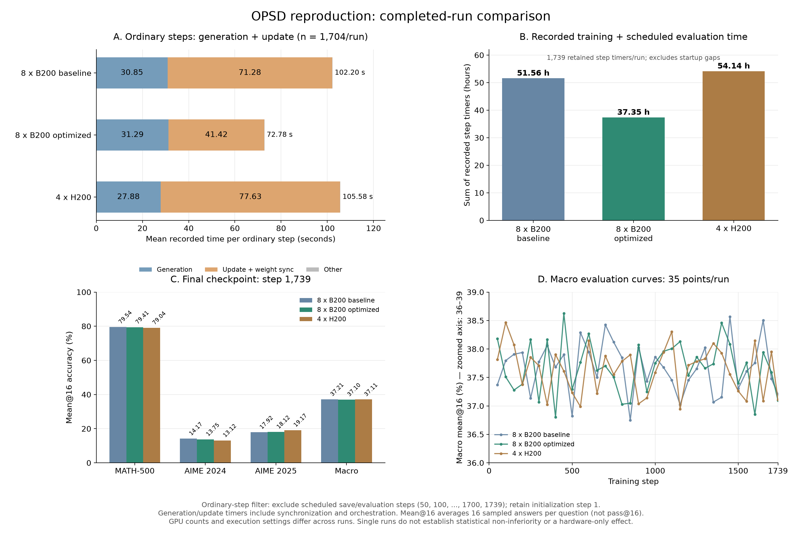

# 优化 B200、原 B200 与 H200 全量对比

## 结论

**优化 B200 全量成功，完整 all 流程37.64小时，比原 B200 的51.84小时减少27.40%（约14.20小时）；普通步减少28.79%，更新加权重同步减少41.89%。** Rollout生成时间没有加快。最终三个benchmark相对原B200两项略降、一项略升，宏平均低0.1111个百分点；单次随机运行不能证明严格无损。

相对4×H200，优化8×B200的全部step累计时间减少31.01%，但同口径GPU小时增加37.99%。卡数、attention内核、随机轨迹和互联状态不同，因此这张表用于比较实际部署结果，不能解释为B200相对H200的单卡硬件加速比或账单成本。

## 1. 三组实验与共同设置

| 项目 | 优化8×B200（本次） | 原8×B200 | 4×H200 |
|---|---|---|---|
| 主run | `tip-20261001T003630Z-3211352` | `tip-20260928T061500Z-1228422` | 初始`tip-20260924T153731Z-542930`；恢复`tip-20260924T174814Z-1211426` |
| 训练状态 | 1739步完成 | 1739步完成 | 1739步完成；从step50恢复 |
| GPU wrapper / launcher | 0 / 0 | 0 / 0 | wrapper=5：训练后overlay guard；保留原退出状态 |
| GPU / FSDP | 8 / 8 | 8 / 8 | 4 / 4 |
| Rollout TP / 副本 | 2 / 4 | 2 / 4 | 2 / 2 |
| GPU microbatch | 1 | 1 | 1 |
| 训练attention | FA2 | FA2 | FA2 |
| Rollout attention | 官方FA4 | 官方FA4 | FA3 |
| Teacher logits cache | CUDA | CPU | CPU |
| Teacher / actor / optimizer | 驻留GPU，相应offload关闭 | CPU offload | CPU offload |
| 正式profiling / overlap | 关闭 / 关闭 | 关闭 / 关闭 | 关闭 / 关闭 |
| Checkpoint / 完整评测次数 | 35 / 35 | 35 / 35 | 35 / 35 |
| 结果入口 | [本次审计](RESULTS.md) | [原B200审计](../taihua-b200-20260930/RESULTS.md) | [H200审计](../beijing-h200-20260927/RESULTS.md) |

三组共同保留：原始Qwen3-8B教师→Qwen3-4B学生、固定revision和数据资产、BF16前向/FP32 loss、global TIP Soft-OR50% / reverse KL、每步8prompt×16rollout、prompt2048/response8192/OPD16384、chunk512、AdamW LR1e-6 / cosine1739 / warmup0 / wd0.1 / clip1、每50步和最终步保存/验证。采样temperature1、top_p1、top_k−1、thinking=False；验证每题n16。详细固定revision和边界修复见 [本次设置表](RESULTS.md#3-模型方法和-rollout-设置)。

H200去重后的step1–50取初始run、51–1739取恢复run，已废弃的初次step51–53不重复计入。新优化实现另包含全局零选择rank时的scheduler一致性修复，该分布式边界差异在本次结果和优化设计中明确记录。

## 2. 耗时与资源口径

| 指标 | 优化8×B200 | 原8×B200 | 4×H200 |
|---|---:|---:|---:|
| 全部有效训练步 | 1739 | 1739 | 1739 |
| 普通步样本数 | 1704 | 1704 | 1704 |
| 普通步整步均值（s） | **72.7804** | 102.1982 | 105.5754 |
| 普通步整步中位数（s） | 72.6533 | 102.2873 | 104.9727 |
| 普通步生成均值（s） | 31.2929 | 30.8474 | 27.8840 |
| 普通步更新+同步均值（s） | **41.4186** | 71.2799 | 77.6264 |
| 全部step计时求和（h） | **37.3526** | 51.5632 | 54.1396 |
| 正式训练shell边界（h） | 37.4189 | 51.6292 | 无同口径完整值 |
| 完整all壁钟，含prepare/smoke/收尾（h） | **37.6353** | 51.8386 | 无同口径完整值 |
| step口径GPU小时 | 298.8206 | 412.5055 | 216.5583 |
| 完整all口径GPU小时 | 301.0822 | 414.7089 | 无同口径完整值 |
| 训练有效response tokens | 436303728 | 436568929 | 436936505 |
| 每步平均有效response tokens | 250893.46 | 251045.96 | 251257.33 |

普通步统一排除50倍数和最终1739，共1704条；保留step1冷启动，H200也保留恢复step51，故不称为纯稳态数据。`timing/train_s`包含训练更新与actor→rollout权重同步；完整step求和含步内保存/评测，但不含launcher准备、smoke、初始模型加载或H200中断间隙。不同口径不能混算提速。

GPU小时=GPU数量×对应时长，表示按该时长分配这些卡的量；不是活跃计算GPU小时，也没有设备价格或账单依据。新B200相对原B200节省约113.63个完整all口径GPU小时；相对H200的step口径则多82.26个GPU小时。

### 新优化相对两组历史结果

| 指标 | 相对原8×B200 | 相对4×H200 |
|---|---:|---:|
| 普通步时间减少 | **28.7851%**（1.4042×） | 31.0631%（1.4506×） |
| 更新+同步时间减少 | **41.8930%**（1.7210×） | 46.6437%（1.8742×） |
| 生成时间变化 | 增加1.4443% | 增加12.2254% |
| 全step时间减少 | **27.5596%**（1.3804×） | 31.0069%（1.4494×） |
| 完整all时间减少 | **27.3991%**（1.3774×），少14.2033h | 不计算：H200缺同口径wall值 |
| 有效response token总量变化 | −0.06075% | −0.14482% |
| step口径GPU小时变化 | −27.5596% | +37.9862% |

时间减少=(原时间−新时间)/原时间；速度倍数=原时间/新时间。两组B200的token总量接近，支持收益并非来自大幅缩短总响应，但逐步长度分布和后续策略不同；这不是相同输入的配对试验。完整全量观测与有界测试指向相同更新路径，仍不支持把收益精确分摊到每项改动。

## 3. 最终step1739精度

所有值为**mean@16**，不是pass@16；三组按预定最终step1739比较，不以不同checkpoint的单项最好值替代。

| Benchmark | 优化8×B200 | 原8×B200 | 4×H200 | 新−原B200（百分点） | 新−H200（百分点） |
|---|---:|---:|---:|---:|---:|
| MATH-500 | **79.4125%** | 79.5375% | 79.0375% | −0.1250 | +0.3750 |
| AIME24 | **13.7500%** | 14.1667% | 13.1250% | −0.4167 | +0.6250 |
| AIME25 | **18.1250%** | 17.9167% | 19.1667% | +0.2083 | −1.0417 |
| 三项等权宏平均 | **37.0958%** | 37.2069% | 37.1097% | −0.1111 | −0.0139 |

| 最终正确输出数 | 优化8×B200 | 原8×B200 | 4×H200 |
|---|---:|---:|---:|
| MATH / 8000 | 6353 | 6363 | 6323 |
| AIME24 / 480 | 66 | 68 | 63 |
| AIME25 / 480 | 87 | 86 | 92 |

相对原B200，本次MATH少10个正确采样、AIME24少2个、AIME25多1个。16次采样集中于同一道题，不能把AIME的480条当成480道独立题。每组只有一个训练seed轨迹，不能据这个小差值确认优化“无精度损失”，也不能确认它造成了显著退化；若要做非劣效结论，需要另外约定重复运行和判定标准。

本次最好宏平均的单一checkpoint为step450，38.6250%；它是训练过程中在这些benchmark上事后选择的验证结果，不能替换预定最终对照或声称测试泛化提高。三项各自最高checkpoint不同，严禁拼接。



图A为普通步生成/更新均值；图B为1739步计时求和；图C为最终三项mean@16与等权宏平均；图D为35点评测宏平均曲线，纵轴36–39%已明确标注。数据与可重绘文件见 [JSON](comparison.json)、[CSV](comparison_metrics.csv)、[SVG](summary.svg)、[脚本](plot_results.py)。

## 4. 方法对齐、硬件归因和限制

1. **此次优化主要针对搬运与驻留。** 保留TIP/loss、模型revision、精度、采样、batch与schedule；GPU cache及参数/Adam驻留减少CPU↔GPU搬运。有界数值gate和真实Qwen集成/容量/恢复通过，本次1739步再次验证可完成整个过程。完整方法说明见 [设计记录](../../OPD_OPTIMIZATION_DESIGN.md)。
2. **教师差异继续保留。** 使用原始Qwen3-8B，而非论文GRPO教师等完整设定；缺step0和教师评测。完成训练不等于论文全部精度复现。
3. **卡数和内核存在差异。** H200为4卡/FA3、B200为8卡/官方FA4；没有相同卡数、相同生成轨迹和健康互联状态下的硬件单变量对照。
4. **NVLink异常未确认恢复。** GPU2此前只读快照显示异常；没有证据证明原B200全量全程同状态。本次仅整理结果，未做硬件reset/修复，也未重查端口；不能将两次全量速度差严格归于软件或固件，更不能写成异常已修复。
5. **现有计时不能定性为单一memory-bound。** 生成、教师/学生计算、FSDP/TP通信、搬运和权重同步共同决定时间；优化实验已经确认更新路径的搬运有可观成本，尚缺HBM带宽等专门测量。
6. **显存指标不做直接倍数比较。** 不同组worker allocator峰值重置语义不同，且不覆盖SGLang/整卡占用；容量smoke的NVML峰值也不能替代这次全量峰值。
7. **原退出码和验证层次保留。** H200训练完成而wrapper exit5的历史事实不改写；本次B200正常退出。最终checkpoint仅清单/extra-state/data CPU核验，没有新做最终模型重载推理。

## 5. 数据来源与复算

- 新B200：[完整审计](RESULTS.md)、[1739步](training_metrics.csv)、[35点评测](eval_curve.csv)。
- 原B200：[汇总](../taihua-b200-20260930/summary.json)、[1739步](../taihua-b200-20260930/training_metrics.csv)、[35点评测](../taihua-b200-20260930/eval_curve.csv)。
- H200：[汇总](../beijing-h200-20260927/summary.json)、[1739步](../beijing-h200-20260927/training_metrics.csv)、[35点评测](../beijing-h200-20260927/eval_curve.csv)。
- 统一计算：[comparison.json](comparison.json)含公式、输入hash和限制；[comparison_metrics.csv](comparison_metrics.csv)保存数值表；[compare_runs.py](compare_runs.py)可CPU复算。没有用估算替代完整wall time缺失值。

```bash
cd /volume/pt-train/users/zhaoye/OPSD_B200_Optimize
python3 results/taihua-b200-optimized-20261003/compare_runs.py
python3 results/taihua-b200-optimized-20261003/plot_results.py
```

**汇报建议：** 优化8×B200完整跑通，比原8×B200全流程少27.4%，主要提升更新与同步阶段；最终三项精度有小幅升降，单次结果不作严格无损结论。比4×H200的累计step耗时短31.0%，但GPU小时更多，不能宣称同资源成本更优或单卡硬件提升。
